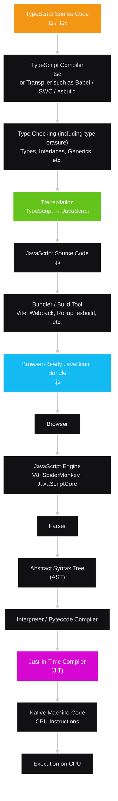

## About

This is [part 9 of the fullstack open course](https://fullstackopen.com/en/part9) by <https://studies.cs.helsinki.fi>

[New Course Platform for Typescript](https://courses.mooc.fi/org/uh-cs/courses/full-stack-open-typescript/)

### Github Actions Test Status

Branches `chapter-2` do not have triggered tests through GitHub workflow actions. There is no `chapter-1` branch.

<!-- <details>
<summary> chapter-4 </summary>

</details>
<br/> -->

## Chapter 2 | Background and Introduction

This chapter provides an overview of Typescript.

### What is [Typescript](https://www.typescriptlang.org/)?

- Typed superset of JavaScript.
- Can be compiled into Javascript standard ECMAScript 3 or newever.
- **All existing Javascript code is valid Typescript**.

### What is Typescript for?

- Designed for large Javascript development.
- Has development-time tooling, static code analysis, compile-time type checking and code-level documentation.




> Browsers understand standardized JavaScript, not TypeScript. TypeScript exists primarily as a development-time language and type system layered on top of JavaScript.

#### What is the Just-In-Time Compiler?

A Just-in-Time (JIT) compiler converts Javascript into native machine code while the program is running.

The Central Processing Unit (CPU) cannot execute JavaScript source code directly. The JavaScript engine first analyzes the code, then the Just-in-Time (JIT) compiler can optimize frequently executed code and turn it into fast machine instructions.

### Key Language Features

#### Type Annotations

Enforces the behaviour of a function or variable.

A function that returns a string:

```typescript
const hello = (name: string): string => {
    return `Hello ${name}!`;
};

console.log(hello("world"));
```

Similarly like Javascript, semi-colons `;` are optional as Typescript follows Javascript rules for Automatic Semicolon Insertion (ASI).

> However, many codebases still use semicolons consistently because they can prevent edge cases where Automatic Semicolon Insertion (ASI) interprets adjacent lines unexpectedly.

#### Keywords

TypeScript inherits all the reserved keywords from JavaScript.It also has its own type-related keywords like `interface`, `type`, `enum`, `implements`, `declare`.

#### Structural Typing

Typescript decides whether two values are compatible based on their shape—that is, the properties and methods they have—rather than requiring them to share the same explicitly declared type name.

For example:

```typescript

class Dog {
  name: string;
}

class Cat {
  name: string;
}

// Can be used interchangeably
let dog: Dog = new Cat();
```

Structural typing is NOT by type name.

#### Type Inference

Infering a type when the type has not be explicitly given. It can determine a type based on contextual typing such as where a value is being used. This occurs during compile-time type analysis.

#### Type Erasure

**No type information remains at runtime**.

The lack of runtime type information can be surprising for programmers who are used to extensively using _reflection_ or other metadata systems.

Languages such as Java and C# provide substantial runtime _reflection_ facilities. A framework can inspect a class and discover information about it dynamically.

Metadata is essentially extra information attached to program elements that survives into runtime, or is otherwise made available to runtime code.Because TypeScript erases types, frameworks sometimes need another way to preserve information they care about.

### Why use Typescript?

- Type checking and static code analysis can reduce runtime erros, and reduce the number of unit tests. It safeguards against typos and doing something out of scope.
- Code-level documentation makes it easier to work on existing code as the a function signature can provide the types of data is can return.
- Types can be reused.
- IDEs can provide specific and smarter code hints or suggestions.
- Makes refactoring code easier do.
- Allows adoption of latest Javascript feature early.

### What Typescript cannot do?

- Checks types only at compile time; runtime errors can still occur.
- External data, such as network responses, is a common source of runtime type mismatches.
- Third-party libraries may have missing, incomplete, or incorrect type declarations.
- [DefinitelyTyped](https://github.com/DefinitelyTyped/DefinitelyTyped) is a common source for community-maintained TypeScript declaration files.
- Type inference is strong but not perfect; sometimes the compiler needs additional guidance.
- Type assertions and type guards can help, but incorrect assertions can hide real problems.
- Complex TypeScript types can produce difficult error messages.

> For long TypeScript errors, the most useful detail is often near the end.

## Chapter 3

Development in Typescript with Express and React.

### Setup

1. Install support to allow Node.js to make use of type checking, compilation, and richer tooling. This package provides the Typescript Compiler (TSC).

```bash
npm install --save-dev typescript
```

Reason: Node.js removes type annotations and relies on remaining Javascript.

1. Use `script` in `package.json` to type check Typescript code.

```json
{
  // treat files in this package as ES modules (ESM) rather than CommonJS modules
  "type": "module",
  // use import/export syntax instead of require
  "scripts": {
   "tsc": "tsc --noEmit"
  },
  "devDependencies": {
    "typescript": "^5.9.3"
  }
}
```
See `chapter-3/package.json`.

To validate type checking on a file:

```bash
npm run tsc file.ts
```

`--noEmit` flag instructs compiler to not generate Javascript output.

1. Configure `tsconfig.json`:

```json
{
  "compilerOptions":{
    "noImplicitAny": false,
    "noEmit": true
  }
}
```

A file to instruct the Typescript compiler how to interpret code, i.e., how it should work, which files to consume and ignore, and [more](https://www.typescriptlang.org/docs/handbook/tsconfig-json.html).

[`noImplicitAny`](https://www.typescriptlang.org/tsconfig#noImplicitAny) - set to `false` to not enforce all variables to require type.

1. Remove `--noEmit` from the line `"tsc": "tsc --noEmit"` in `package.json` to reduce redundancy since it is also set in `tsconfig.json`.
